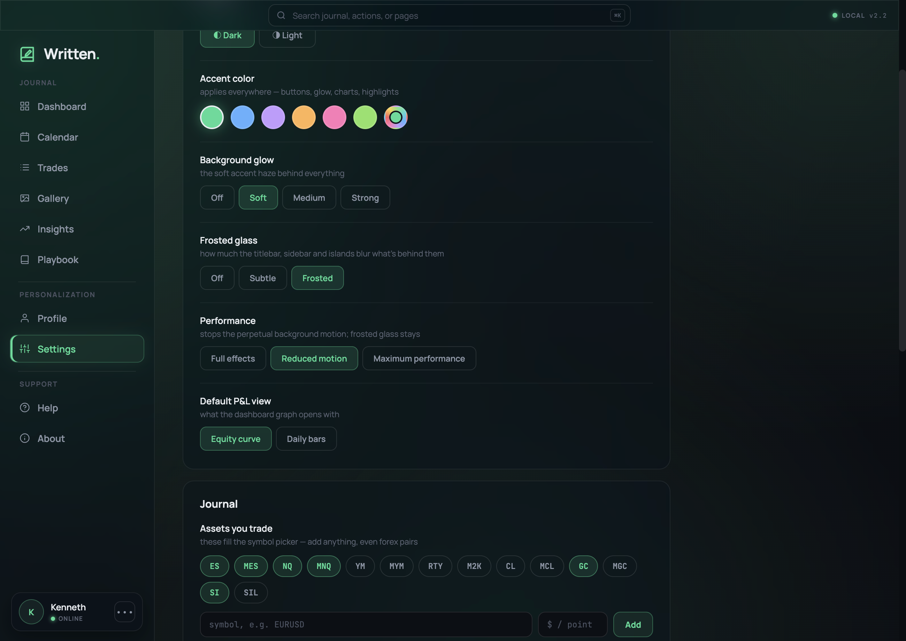

<div align="center">

# 📓 Written

### A private futures trading journal that lives on your machine.

**No account. No server. No cloud.** Your trades never leave your Mac or PC.


</div>

---

## ✨ What it does

Written is a local-first journal for futures traders. Log every execution with entry, stop and
target, annotate your screenshots, and watch your edge take shape across the calendar.

| | |
|---|---|
| 📊 **Dashboard** | Equity curve, win rate, drawdown and streaks at a glance |
| 🗓️ **Calendar** | Every trading day colour-coded by P&L |
| 📋 **Trades** | Full execution table — entry, stop, target, exit, R, hold time |
| 🖼️ **Gallery** | Chart screenshots with drawable annotations |
| 📈 **Insights** | Time-of-day edge, tag performance, mistake tracking |
| 📕 **Playbook** | Your setups, written down and kept honest |
| 👥 **Profiles** | Multiple journals, switchable, all local |

---

## 📥 Install

> [!IMPORTANT]
> Builds are **ad-hoc signed**, not notarized. macOS and Windows will both warn you on first
> launch. That's expected for a self-distributed app — steps to get past it are below.

### 🍎 macOS

1. Download the `.dmg` for your Mac from **[Releases](../../releases)**
   - 🚀 **Apple Silicon** (M1/M2/M3/M4) → `Written-1.0.0-arm64.dmg`
   - 💻 **Intel** → `Written-1.0.0.dmg`
2. Open it and drag **Written** into **Applications**
3. Launch it

If macOS says the app *"cannot be opened"* or *"is damaged"*, clear the download quarantine flag:

```bash
xattr -dr com.apple.quarantine /Applications/Written.app
```

### 🪟 Windows

1. Download `Written Setup 1.0.0.exe` from **[Releases](../../releases)**
2. Run it — SmartScreen will warn, click **More info → Run anyway**
3. Pick your install folder and finish

One installer covers both **x64** and **ARM64**.

---

## 💾 Where your data lives

One JSON file, written atomically. Nothing else, nowhere else.

```
🍎 macOS    ~/Library/Application Support/Written/written-store.json
🪟 Windows  %APPDATA%\Written\written-store.json
```

**That file is your entire journal** — so it's also your backup. Copy it to keep a snapshot, or drop
it into the same path on another machine to bring your history with you. It survives app updates and
reinstalls, because it lives outside the app bundle.

> [!TIP]
> Trade screenshots are stored inline as base64. In a browser these would blow past the ~5–10 MB
> `localStorage` quota; in the desktop build they go to this file, which has no such limit.

---

## ⚡ Performance Mode

The UI layers ~18 frosted-glass panels over large animated background glows. That's gorgeous, and on
a 120 Hz display it's also expensive — the GPU can't re-blur all that glass every frame.

**Settings → Performance**, or **View → Performance Mode** (`⌘⌥1` / `⌘⌥2` / `⌘⌥3`):

| Mode | Frame time | FPS | Frosted glass |
|---|---|---|---|
| 🎨 **Full effects** | 13–32 ms | 31–73 | ✅ |
| ⚖️ **Reduced motion** *(default)* | **8.3 ms** | **120** | ✅ **kept** |
| 🚀 **Maximum performance** | **8.3 ms** | **120** | ❌ |

**Reduced motion** is the default: it reaches a locked 120 fps *while keeping every glass panel*, so
the design stays intact — you only lose the perpetual background drift. Both surfaces control one
setting; changing either updates the other.

<div align="center">

</div>

---

## 🛠️ Development

### Requirements

- **Node.js** 18+
- **macOS** to build the `.dmg` (the Windows installer cross-builds from macOS — electron-builder
  downloads its own Wine automatically 🍷)

### Run it

```bash
cd desktop
npm install
npm start
```

### Build installers

```bash
npm run dist:mac    # → desktop/dist/macOS/
npm run dist:win    # → desktop/dist/Windows/
```

Both architectures at once:

```bash
npx electron-builder --mac --arm64 --x64 --config.directories.output=dist/macOS
npx electron-builder --win --x64 --arm64 --config.directories.output=dist/Windows
```

### Test

```bash
node --test test/written-v2.logic.test.cjs     # 123 tests
```

---

## 🏗️ How it's built

The app is a **React 18 SPA** running on an in-house `dc-runtime`: an HTML template inside `<x-dc>`
plus a logic block in `<script type="text/x-dc">`. The Electron layer wraps *around* it.

```
written-journal/
├── 📱 app/                     the application itself
│   ├── Written v2.dc.html      template + logic (the whole app)
│   └── support.js              dc-runtime
├── 🖥️ desktop/                 the Electron wrapper
│   ├── main.js                 window, menus, atomic file store
│   ├── preload.js              contextBridge (isolated, no nodeIntegration)
│   ├── ipc-channels.js         shared IPC contract
│   ├── renderer/
│   │   ├── index.html          ⚙️ GENERATED — do not hand-edit
│   │   ├── store-shim.js       localStorage → file store
│   │   ├── perf.*              Performance Mode
│   │   ├── native-chrome.*     native traffic lights / title bar
│   │   └── vendor/             offline React + self-hosted fonts
│   └── scripts/build-renderer.js
├── 🧪 test/
└── 📦 release/                 built installers (gitignored)
```

### Design notes

🔌 **Fully offline.** React, ReactDOM and the fonts are vendored locally — the app makes **zero**
network requests at boot. Verified, not assumed.

🔒 **Locked down.** `contextIsolation: true`, `nodeIntegration: false`, and a CSP. The renderer
reaches the filesystem only through four named IPC channels.

🧬 **The app stays the app.** `scripts/build-renderer.js` regenerates `renderer/index.html` from
`app/Written v2.dc.html` and **refuses to write** if wrapping altered the app's logic block (verified
by sha256). Never edit `renderer/index.html` by hand:

```bash
cd desktop && npm run build:renderer
```

💾 **Saves can't fail silently.** Writes are debounced then written atomically (tmp + rename). The
promise rejection is explicitly caught, retried, and surfaced as a visible banner — and the
last-chance flush on quit is *synchronous*, because `beforeunload` doesn't fire on force-quit.

---

## 🚢 Publishing a release

Installers are **not** in git — the Windows one is ~153 MB, past GitHub's hard 100 MB per-file
limit — so they ship as Release assets:

```bash
# build both platforms first, then:
gh release create v1.0.0 \
  desktop/dist/macOS/Written-1.0.0-arm64.dmg \
  desktop/dist/macOS/Written-1.0.0.dmg \
  "desktop/dist/Windows/Written Setup 1.0.0.exe" \
  --title "Written 1.0.0" \
  --notes "First public build 🎉"
```

Or drag them into **Releases → Draft a new release** in the GitHub UI. Locally built installers are
kept in `release/` for convenience.

---

## 🗺️ Roadmap

- [x] 🎨 App icon — the Written mark, generated for both platforms
- [ ] ✅ Code signing + notarization, to drop the first-launch warnings
- [x] ⚖️ Third-party license attribution (About → Open Source)
- [ ] 🖼️ Move screenshots to content-addressed files so the JSON store stays small
- [ ] 📤 Export / import for moving a journal between machines
- [ ] 🔄 Auto-update

---

<div align="center">

**Built for traders who'd rather own their data.** 📈

<sub>Detailed engineering notes — measurements, trade-offs, gotchas — live in
<a href="docs/DESKTOP-NOTES.md">docs/DESKTOP-NOTES.md</a></sub>

</div>
